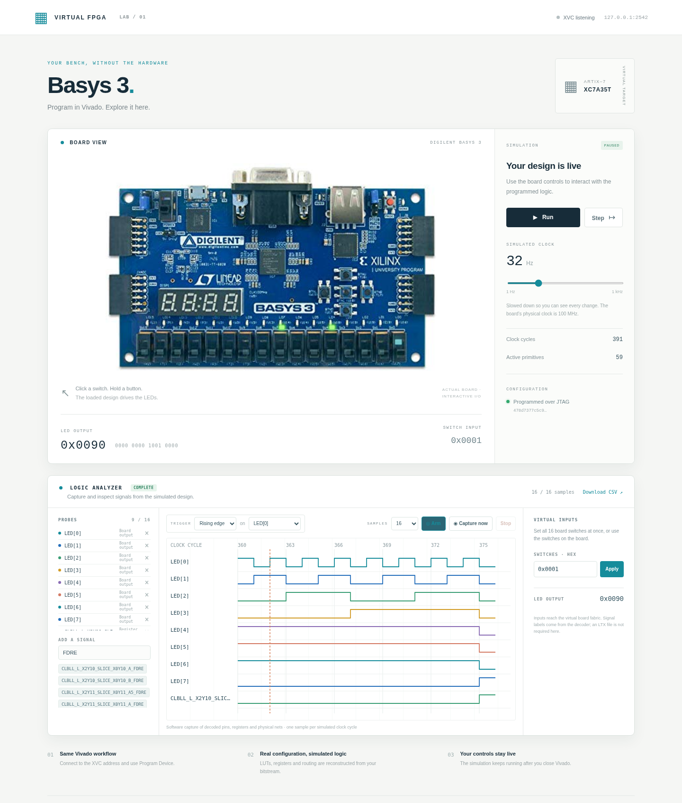
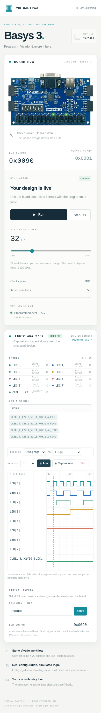

# Virtual Basys3 FPGA for Vivado

This project makes Vivado Hardware Manager see a software-only Artix-7 FPGA.
Vivado connects to it through Xilinx Virtual Cable (XVC), so no physical board
or USB cable is required.

The easiest working demo is the included eight-bit counter. You program it from
Vivado, then use a Basys3 board page in your browser to control its switches,
watch its LEDs, and capture simulated signal waveforms.

## Webpage screenshots

The supplied counter running in the browser, with a local logic capture and
virtual switch control:



<details>
<summary>Mobile screenshot</summary>



</details>

## What you need

- Linux, or Windows 10/11 with WSL2 and Ubuntu for the simulator
- Python 3.10 or newer, including `venv` and `pip`
- Git, a C/C++ compiler, and build tools
- Yosys available on `PATH`
- Vivado with support for `xc7a35tcpg236-1`
- About 5 GB of free disk space and 4 GB of available RAM

The project has been tested with Vivado 2025.1 on Linux. On Windows, run the
decoder and virtual board in WSL2 and use Windows Vivado Hardware Manager to
program it. Native Windows decoding is not currently supported.

On Ubuntu, the non-Vivado tools can usually be installed with:

```sh
sudo apt install python3 python3-venv python3-pip python-is-python3 git build-essential yosys
```

If your shell cannot find `vivado`, load your installation's environment first,
for example `source /tools/Xilinx/Vivado/2025.1/settings64.sh`.

## First-time setup

On Linux, open a terminal and run:

```sh
git clone https://github.com/xp4t/virtual-basys3.git
cd virtual-basys3
python setup.py
```

The root `setup.py` runs `setup.sh`, which delegates to the pinned dependency
setup under `scripts/`. You can also run `bash setup.sh` directly. Setup creates
`.venv`, installs the Python packages, and downloads the pinned Project X-Ray
databases and decoder tools. It can take several minutes.

Next, build the included counter bitstream with Vivado:

```sh
vivado -mode batch -source scripts/build_counter.tcl -log build/counter-build.log
```

The finished file is `build/counter/counter.bit`.

### Windows with WSL2

Install [WSL2 and Ubuntu](https://learn.microsoft.com/windows/wsl/install)
from an Administrator PowerShell window, then restart Windows if prompted:

```powershell
wsl --install -d Ubuntu
```

Open **Ubuntu**, install the Linux tools, and clone and set up the repository
there. Run `setup.sh` in Ubuntu, not in PowerShell or Git Bash:

```sh
sudo apt update
sudo apt install python3 python3-venv python3-pip python-is-python3 git build-essential yosys
git clone https://github.com/xp4t/virtual-basys3.git
cd virtual-basys3
python setup.py
```

Keep the terminal in this repository for `python script.py`. Build or choose
your `.bit` in **Windows Vivado**; Vivado sends the selected bitstream over XVC,
so the file does not need to be copied into WSL. The included counter build
script has only been validated with Linux Vivado. If you keep the checkout on
the Windows filesystem instead, `py setup.py` and `py script.py` from
PowerShell forward execution into WSL2. Both commands require WSL2 and its
Linux tools and Python on the Windows host; they do not install the decoder
natively on Windows. A checkout
under the WSL home directory is faster for Linux build tools than one under
`/mnt/c`, as [Microsoft documents](https://learn.microsoft.com/windows/wsl/filesystems).

Windows applications can normally reach WSL2 services at `localhost` by
default. This is the networking path used by the browser and Vivado here; see
[Microsoft's WSL networking guide](https://learn.microsoft.com/windows/wsl/networking)
if your WSL networking configuration differs.

## Run the virtual FPGA

Start the virtual lab from the repository root:

```sh
python script.py
```

The root `script.py` calls `scripts/start_local_lab.py`; both work from any
current directory when invoked by absolute path. On Linux it starts XVC, the
board page, and `hw_server` together. Set `XILINX_VIVADO` to the Vivado
installation directory or pass `--vivado-root` if `hw_server` is not on `PATH`.
On WSL2 without Linux Vivado it starts XVC and the board page, leaving Windows
Vivado to start its own `hw_server`. From a Windows checkout with WSL2 already
set up, `py script.py` forwards to the same WSL2 mode. If your terminal has no
`python` command, use `python3 script.py`.
Use `python script.py --no-hw-server` if you already manage `hw_server`
separately on Linux.

Leave the terminal running. It prints the board URL and Tcl connection
commands. The defaults are XVC `127.0.0.1:2542`, board page
<http://127.0.0.1:8080>, and Linux `hw_server` `127.0.0.1:3121`. The page
initially says the device is not configured.

For a separately managed Vivado `hw_server`, the lower-level command is:

```sh
.venv/bin/python xvc-server/server.py --simulate
```

It prints messages containing:

```text
Board companion: http://127.0.0.1:8080
Virtual xc7a35t XVC listening on 127.0.0.1:2542
```

## Connect Vivado

In Vivado:

1. Open **Hardware Manager**.
2. Select **Open Target**, then **Add Xilinx Virtual Cable**.
3. Enter host `127.0.0.1` and port `2542`.
4. Let Vivado auto-connect. It should find one `xc7a35t` device.
5. Select **Program Device**.
6. Choose `build/counter/counter.bit` and start programming.

You can also connect from Vivado's Tcl console:

```tcl
open_hw_manager
connect_hw_server -url TCP:127.0.0.1:3121
open_hw_target -xvc_url 127.0.0.1:2542
```

On Linux the launcher starts `hw_server` on port `3121`; on Windows, Vivado
starts its own local `hw_server`. The XVC simulator listens on port `2542` in
either case; these are separate services. If the first
target-open reports no devices, close the target and open it again after a few
seconds while the XVC endpoint finishes registration. The repository's batch
acceptance scripts retry this discovery automatically.

After programming, the server decodes the bitstream and builds its simulation
model. The first decode is slow and may use about 3 GB of RAM; later runs reuse
the generated files. Wait until the browser page reports **Ready**.

Turn on switch **SW0** to enable the demo counter. LEDs 0 through 7 will count.
The browser's Run, Pause, Step, and speed controls change the simulated clock.
Press the center button to reset the counter.

In the **Logic Analyzer** panel, select up to 16 decoded probes and a trigger,
then select **Arm** and run or step the board. **Capture now** takes an
immediate capture by advancing the simulation and leaves it paused. Choose
16–4096 samples and download the result as CSV. Under **Virtual Inputs**, enter
a 16-bit hexadecimal switch word and select **Apply** to update all switches.
The launcher never chooses a design file: select your `.bit` in Vivado's
**Program Device** dialog. You may also select a matching `.ltx` there, but the
localhost analyzer does not use it and Vivado Hardware Manager will not show
native ILA/VIO cores for this software simulator.

The localhost logic-capture API samples board pins, register outputs, and
reconstructed physical nets on each simulated clock. It can arm a 16–4096
sample capture of up to 16 one-bit probes, trigger immediately or on a selected
high, low, rising, or falling condition, and export CSV. `GET /api/logic/catalog`
lists available probes, `GET /api/logic` returns capture state and samples,
`POST /api/logic` accepts `configure`, `arm`, and `stop` actions, and
`GET /api/logic.csv` downloads the samples. `POST /api/control` also accepts a
16-bit `switches` word for virtual input control. These local features use the
working fabric simulator; they do not require Vivado to discover an ILA/VIO
core. Internal names are physical netlist names, since the decoder cannot
recover RTL signal names from the bitstream.

Stop the server with `Ctrl+C` when finished.

## Using your own bitstream

Program an unencrypted, uncompressed Basys3 `xc7a35t` bitstream in the same way.
The simulator currently supports the fabric needed by the included counter:
LUTs, common flip-flops, carry logic, muxes, basic I/O, routing, and simple clock
buffers.

Designs using unsupported resources such as BRAM, DSP, or MMCM blocks will show
an explicit error on the board page. This project does not synthesize or route
your design; Vivado still creates the bitstream.

For a design containing ILA/VIO, the virtual board currently needs a matching
Vivado functional netlist and XSI model in addition to the `.bit` and `.ltx`.
The normal `--simulate` server accepts the bitstream but does not simulate its
debug hub. A `.bit`/`.ltx` pair alone works with a physical Basys3 because the
debug cores run on the FPGA. See [debugging your own design](#debugging-your-own-design).

## Debugging your own design

The intended virtual workflow is to start the XVC server once, then choose the
`.bit` and `.ltx` files in Vivado's **Program Device** dialog. The startup
script should not choose those files. Vivado sends the bitstream over JTAG;
the `.ltx` stays in Hardware Manager and maps probe names to debug cores that
must already exist in the programmed virtual device.

That workflow currently works for programming and the browser board with
supported designs, but **does not yet provide arbitrary ILA/VIO waveforms from
only a `.bit` and `.ltx`**. The normal bitstream simulator has no BSCAN/debug
hub model. The experimental `--debug-hub` mode is a fixed discovery replay,
not an implementation of the debug cores in the selected bitstream. A matching
XSI netlist does provide working ILA/VIO for the supplied counter fixture, but
it is an additional design artifact and cannot be selected by Vivado's file
dialog. Do not interpret a visible ILA from the discovery replay as a valid
capture source.

If a physical Basys3 is connected, put the matching `.bit` and `.ltx` files in
one folder and run this command from that folder:

```sh
python3 /path/to/virtual-basys3/scripts/prepare_debug_session.py
```

The command prints one `source {...}` line. Open Vivado Hardware Manager and
run that line in its Tcl console. It connects to the physical target, programs
your bitstream, loads your probes file, refreshes the device, and checks the
number of ILA/VIO cores against the LTX. If the folder has multiple files, pass
`--bit path/to/design.bit --ltx path/to/design.ltx`. Use `--hw-server-url` or
`--hw-target` when connecting to a remote or non-unique physical target.

The physical board does not need this project's XVC server. AMD's
[Vivado debug guide](https://docs.amd.com/r/2021.1-English/ug908-vivado-programming-debugging/Reading-Debug-Probes-Information)
describes using the bitstream and probes file for Hardware Manager debugging.
The script cannot prove that two independently supplied files came from the
same implementation; Vivado's core discovery provides that final check.

With no physical board, `--simulate` cannot currently provide a working ILA
from only those two files. The supplied counter ILA/VIO fixtures work through
their matching XSI functional models; arbitrary bitstreams require additional
debug-core and fabric emulation. `--target virtual` on the preparation script
reports this limit before starting a misleading session.

## Common problems

### Windows cannot reach the WSL2 board page or XVC port

First try <http://127.0.0.1:8080> in a Windows browser while `python script.py`
is still running in Ubuntu. If localhost forwarding is unavailable, restart
the script in Ubuntu with `python script.py --no-hw-server --host 0.0.0.0`, run
`hostname -I` there, and use its first IP address instead of `127.0.0.1` for
the browser URL and Vivado's XVC host. The WSL2 IP can change after a restart;
see [Microsoft's networking instructions](https://learn.microsoft.com/windows/wsl/networking).

### Vivado finds no device

Keep the XVC server running, close the hardware target, and open it again. Vivado
2025.1 occasionally needs a second connection while a new XVC target is being
registered. Confirm that `ss -ltn` shows the XVC endpoint on `2542` and the
Hardware Manager server on `3121`, then reconnect with:

```tcl
disconnect_hw_server -quiet
connect_hw_server -url TCP:127.0.0.1:3121
open_hw_target -xvc_url 127.0.0.1:2542
```

The native ILA/VIO flow uses a different stack: its XVC endpoint is `2548` and
its dedicated `hw_server` is `3127`. Do not connect the simulator XVC on `2542`
to the native debug `.ltx` flow, or connect the native XSI endpoint to the
simulator's default `3121` server.

### Vivado reports no debug hub after loading an LTX file

Check `PROGRAM.FILE` and `PROBES.FILE` on the device. They must come from the
same debug build directory. The plain `build/counter/counter.bit` has no ILA or
VIO, so pairing it with `build/debug_vio_counter/counter.ltx` produces this
warning. For native debug, start the matching XSI stack and use the printed
Vivado Tcl commands in the [debug guide](debug-hub-emu/README.md#interactive-debugging).

### Programming succeeds, but the board page never becomes ready

Read the error shown on the page and the server terminal. The usual causes are a
missing setup dependency or a resource that the simulator does not support yet.

### Port 2542 or 8080 is already in use

Stop the older server, or select different ports:

```sh
.venv/bin/python xvc-server/server.py --simulate --port 2543 --board-port 8081
```

Use the same XVC port in Vivado and open the matching board-page URL.

### Vivado is on another computer

Start the server so it listens on the network:

```sh
.venv/bin/python xvc-server/server.py --simulate --host 0.0.0.0
```

Connect Vivado to this computer's IP address. XVC has no authentication, so only
do this on a trusted network or behind a firewall.

## Current status

| Feature | Status |
| --- | --- |
| Vivado XVC connection and `xc7a35t` detection | Working |
| Programming with a `.bit` file | Working |
| Counter bitstream decoding and simulation | Working |
| Browser-based Basys3 switches, buttons, and LEDs | Working |
| Browser logic analyzer, CSV export, and virtual switch-word control | Working for supported decoded bitstreams; tested with the counter bitstream |
| General Artix-7 resource coverage | Partial |
| ILA/VIO debugging in Hardware Manager | Physical Basys3 with a matching `.bit`/`.ltx` pair, or supplied virtual fixtures with a matching XSI model |

Native ILA/VIO setup and tests using matching `.bit` and `.ltx` files are
documented in [`debug-hub-emu/README.md`](debug-hub-emu/README.md). This XSI-based
development flow is separate from the counter and board-visualizer demo.

On the virtual server, a Vivado 2025.1 test with the matching
`build/debug_vio_counter/counter.bit` and `.ltx` and `--debug-hub` found one
ILA with a 17-bit input where the LTX declares eight bits, and found no VIO.
The test failed core-count validation. Decoding that debug bitstream with the
current Project X-Ray database reports 42 unknown bits; the bitstream-to-netlist
step also cannot route all debug fabric connections. These are concrete gaps
in the virtual implementation, not a Hardware Manager file-selection issue.

## Tests and validation

The quick regression suites are:

```sh
python3 -m unittest discover -s xvc-server/tests -v
python3 -m unittest discover -s sim-core/tests -v
```

In the current validation, all 24 XVC tests and seven simulator tests pass.
With the supplied counter bitstream loaded, the browser acceptance test
`board-visualizer/tests/logic.cjs` passed switch-word control, probe search,
16-sample waveforms, a rising-edge trigger, CSV export, and mobile layout.

Real Vivado acceptance scripts are also available:

```sh
vivado -mode batch -source scripts/accept_phase1.tcl -log build/phase1.log
vivado -mode batch -source scripts/accept_phase2.tcl -log build/phase2.log
```

For native debug-core acceptance, build the matching XSI model as described in
the debug guide, then run `python3 scripts/accept_phase5.py`. The test programs
the design, validates its LTX probes, and checks captured counter data. The
verified runs discovered one ILA with no VIO and one ILA with one VIO; both
passed 1024-sample capture checks, and the VIO run passed reset, readback, hold,
and enable checks. Logs are saved in each design's `acceptance/` directory.

Reference documents and database provenance are listed in
[`references/README.md`](references/README.md).
